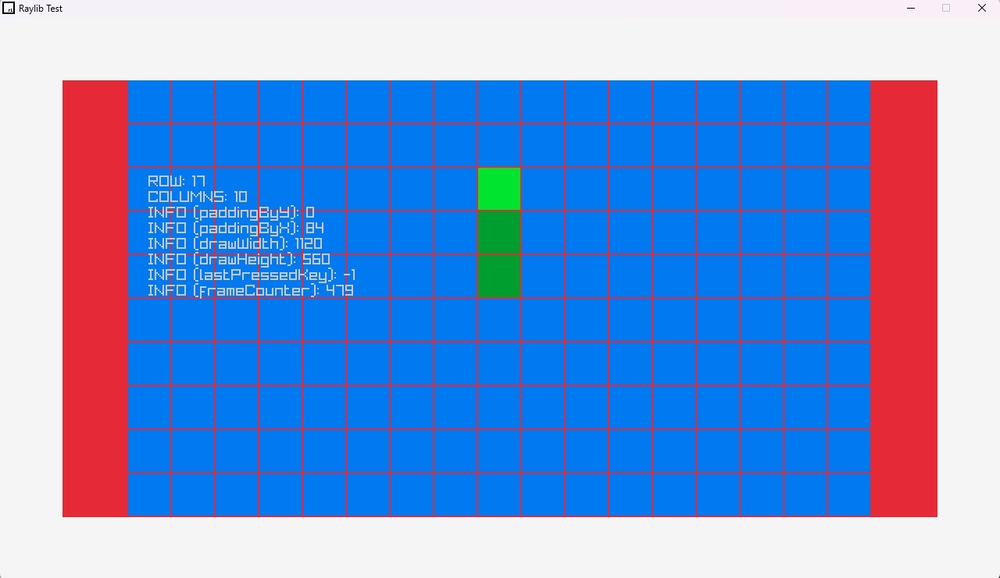

# Snake game on Raylib

## Todo
- Implement
    - Score 
    - Self Collision
    - Validate position of generating food
- Other
    - Game States 
        - Lose State show Score
        - Start State with Start button
    - UI improvements

## References
- RayLib: https://github.com/raysan5/raylib
